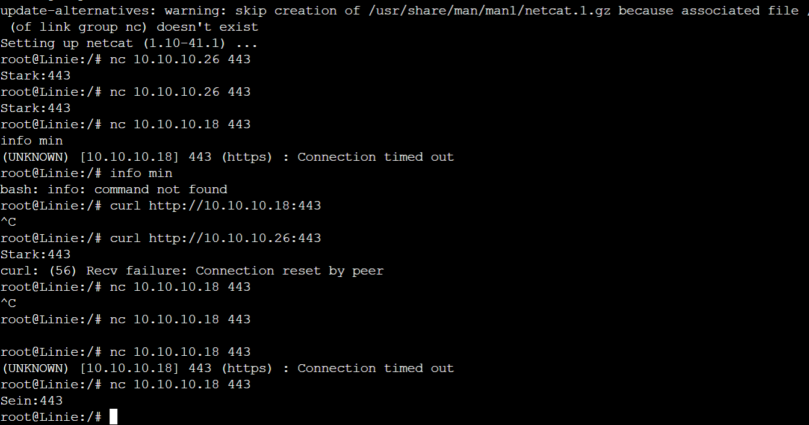
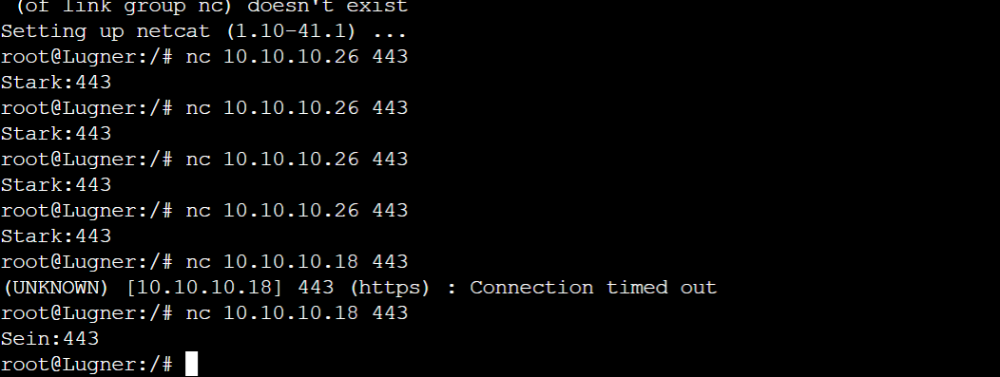
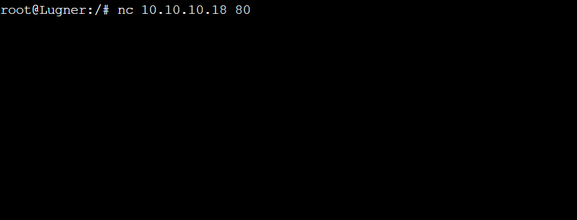

# challenge5

Nama: Putu Ardanatha Pratama

1. "Sein dan Stark port 443 hanya dapat diakses oleh Fern, Flamme, Linie, Lugner"

- **Answer**
  - **Sein port 443** 
  
  
  
  
  
  
  - **Stark port 443**
  
  
  
  
  
  

- **Configuration**
  ```
    iptables -A INPUT -p tcp --dport  443  --source 10.10.10.19 -j ACCEPT
    iptables -A INPUT -p tcp --dport  443 --source 10.10.10.20  -j ACCEPT
    iptables -A INPUT -p tcp --dport  443 --source 10.10.10.28  -j ACCEPT
    iptables -A INPUT -p tcp --dport  443  --source 10.10.10.27 -j ACCEPT
    iptables -A INPUT -p tcp --dport 443 -j DROP
  ```

2. "Sein port 80 hanya bisa diakses oleh Fern dan Flamme"
  - **Sein port 80** 
    
    
    
    
    
    
  - **Configuration**
    ```
      iptables -A INPUT -p tcp --dport  80  --source 10.10.10.28 -j ACCEPT
      iptables -A INPUT -p tcp --dport  80 --source 10.10.10.27  -j ACCEPT
      iptables -A INPUT -p tcp --dport 80 -j DROP
    ```

3. "Stark port 80 hanya bisa diakses oleh Linie dan Lugner"
   - **Stark port 80**
     
     
     
     
     
     

4. "Sein port 443 hanya bisa diakses oleh Denken pada pukul 07.00 - 12.00 dan Stark port 443 hanya bisa diakses oleh Denken pada pukul 13.00 - 18.00"
   - **Stark**
     
     
   - **Sein**
     
     
